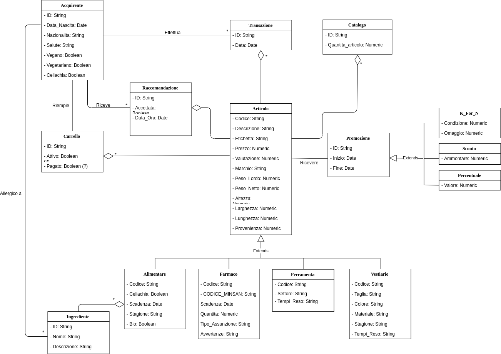
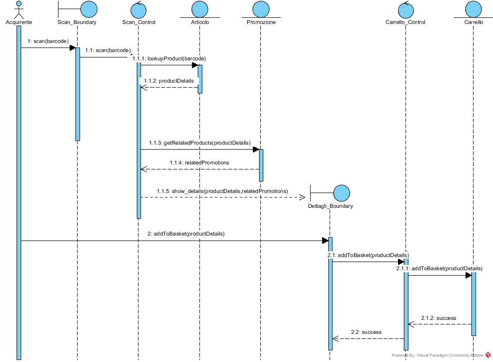
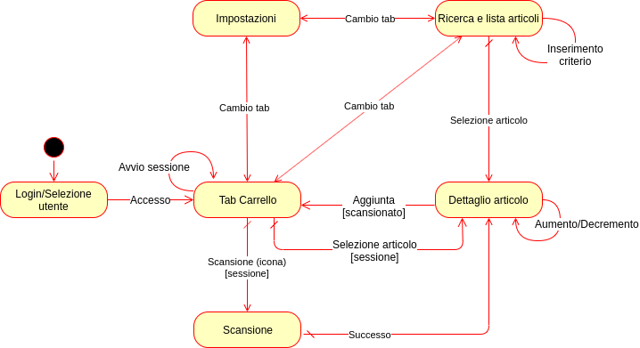

# Introduzione

## Scopo del sistema

La catena di supermercati Coop non può continuare ad ignorare l'esistenza di un mondo costantemente connesso e le grandi disponibilità tecnologiche. Per far fronte alla concorrenza, specie da parte del mondo e-commerce, Coop ha chiesto un'app per smartphone a supporto degli acquisti, in grado di permettere agli acquirenti la lettura del codice a barre degli articoli presenti sugli scaffali con il proprio smartphone e di poterne ottenere delle informazioni dettagliate. Inoltre, che sia anche in grado di proporre agli acquirenti nuovi articoli di interesse tramite un sistema di raccomandazione.

Con questo sistema, Coop vuole attrarre nuovi acquirenti grazie ad un servizio semplice e innovativo nel quale l’utente possa conoscere a fondo gli articoli che sta per acquistare ed essere invogliato ad acquistarne altri, aumentando così gli introiti del supermercato e migliorando l'esperienza degli acquirenti.

## Scope del sistema

Il sistema dovrà fornire una serie di funzionalità:

- Permettere il **recupero di informazioni** degli articoli del supermercato tramite **scansione del codice a barre**, potenzialmente tramite **AR (Augmented-Reality)**;
- Permettere agli acquirenti di **registrarsi e autenticarsi** alla piattaforma;
- Permettere all'acquirente di **aggiungere**, **eliminare**, gestire la **numerosità** e visionare il **costo totale** degli articoli presenti nel carrello;
- Fornire **raccomandazioni basate su promozioni attive** al momento della spesa, a seconda di ciò che un acquirente ha scansionato durante una sessione di acquisto;
- Fornire **raccomandazioni basate su articoli simili** a quelli scansionati in precedenti sessioni di acquisto;
- Fornire **raccomandazioni basate su profili di acquisto simili**;
- Consentire ai gestori del supermercato l'**inserimento e la modifica** delle informazioni associate agli **articoli in vendita**;
- Consentire ai gestori del supermercato l'**inserimento e la modifica delle promozioni** sugli articoli;
- Permettere la **ricerca esplicita degli articoli** in vendita al supermercato;
- Permettere all'utente di effettuare il **pagamento** degli articoli presenti nel carrello.

Il sistema non dovrà:

- Sostituire alcuna piattaforma di gestione interna già in uso dai gestori del supermercato;
- Vincolare l'acquirente all'uso dell'app per accedere alle promozioni ordinarie;
- Obbligare l'acquirente alla registrazione per usare le principali funzionalità dell'app.

## Obiettivi e criteri di successo del progetto

Il progetto si pone i seguenti **obiettivi**:

- Migliorare l'esperienza di acquisto dell'acquirente fornendogli tutte le informazioni per la scelta degli articoli con trasparenza;
- Rendere il sistema prodotto usabile per la maggior parte degli acquirenti tipici del cliente;
- Migliorare la fidelizzazione degli acquirenti grazie ai sistemi di supporto e di raccomandazione;
- Incrementare le vendite di Coop grazie al sistema di raccomandazione che favorisce la vendita degli articoli;
- Realizzare il front-end del sistema come app multipiattaforma (almeno Android e iOS), rivolgendosi alla maggior parte del mercato degli smartphone;

Il progetto sarà di successo se, oltre agli obiettivi, rispetta anche i seguenti **criteri di successo**:

- Rispettare tutte le consegne;
- Implementare le funzionalità a proprità alta prima della consegna finale;
- Implementare il sistema usando le tecnologie multipiattaforma Angular, Ionic e Capacitor.

## Definizioni, acronimi e abbreviazioni

Alcune definizioni, acronomi e abbreviazioni utili per la lettura del documento:

- **Cliente**: committente del sistema, ovvero la catena di supermercati Coop;
- **Acquirente**: persona che acquista uno o più articoli in un supermercato, da non confrondersi con "cliente" di cui sopra;
- **Filiale**: sinonimo di sede (del supermercato);
- **Gestore**: persona predisposta alla gestione del sistema informativo delle sedi del supermercato;
- **AR**: Augmented Reality, realtà aumentata;
- **RF**: Requisito Funzionale;
- **NFR**: Requisito Non Funzionale;
- **UC**: Use case, caso d'uso;
- **SD**: Sequence diagram.

## Riferimenti

Di seguito i riferimenti ad altri documenti relativi al sistema:

- **Problem Statement**, disponibile all'indirizzo: *<https://github.com/EMAD-2019-Accenture/App/blob/master/docs/problem_statement/Problem%20Statement.pdf>*

## Panoramica

Nella sezione *Sistema corrente* viene presentata la situazione attuale per affrontare le esigenze del cliente.

Nella sezione *Sistema proposto* viene presentato nel dettaglio il sistema, anzitutto con una panoramica generale, per poi passare ad elencare i requisiti funzionali e non funzionali. Successivamente, si presentano i vari modelli del sistema: gli scenari, il modello dei casi d'uso, una parte del modello ad oggetti e alcuni elementi dell'interfaccia utente.

# Sistema corrente

Attualmente il cliente dispone di un proprio sistema informativo, con il quale è in grado di inserire o modificare le informazioni degli articoli in vendita, delle promozioni, del magazzino, dei dipendenti, ecc. Il sistema informativo **non si interfaccia in alcun modo con gli acquirenti**.

# Sistema proposto

## Panoramica
Il sistema è composto da due parti principali: 

- un sottosistema **front-end** fornito tramite un'app per smartphone Android e iOS accessibile direttamente dagli acquirenti;
- un sottosistema **back-end** che si occupa dell'interrogazione della base di dati del supermercato tramite opportuni web service. Tutto il back-end è deployato sulla piattaforma *Heroku*.

Gli attori del sistema sono gli **Acquirenti** e i **Gestori** (del supermercato).

La seguente legenda mostra le scadenze relative alle priorità presenti nei requisiti funzionali e non:

|   Priorità  |                Scadenza                |
|:-----------:|:--------------------------------------:|
|   **Alta**  | 15-01-2020 - Seconda release prototipo |
|  **Media**  |      N/A - Release prodotto finale     |
|  **Bassa**  | N/A - Patch del prodotto in produzione |

## Requisiti funzionali

Di seguito sono elencati i requisiti funzionali del sistema. Ciascuno dispone di un identificatore univoco (*RFn*, dove *n* è un numero intero positivo), di un nome, di una breve descrizione, dell'elenco degli attori partecipanti e di una priorità.

I requisiti funzionali del sistema sono riportati nella seguente tabella:

| ID | Nome | Descrizione | Attori Partecipanti | Priorità |
|------|--------------------------------------------------------|-------------------------------------------------------------------------------------------------------------------------------------------------------------------------------------------------|---------------------|----------|
| **RF1** | Scansione codice a barre | Il sistema permetterà la scansione dei codici a barre degli articoli in vendita. | Acquirente | Alta |
| **RF2** | Visualizzazione informazioni articoli | Il sistema permetterà la visualizzazione una serie di informazioni relative all'articolo. | Acquirente | Alta |
| **RF3** | Avvio sessione di acquisto | Il sistema permetterà l'avvio di una sessione di acquisto, che fornisce un carrello dove poter inserire gli articoli scansionati. | Acquirente | Alta |
| **RF4** | Aggiunta articoli al carrello | Il sistema permetterà l'aggiunta di articoli scansionati al carrello se è presente una sessione avviata. | Acquirente | Alta |
| **RF5** | Eliminazione articoli dal carrello | Il sistema permetterà la rimozione di articoli precedentemente inseriti nel carrello se è presente una sessione avviata. | Acquirente | Alta |
| **RF6** | Modifica quantità articoli nel carrello | Il sistema permetterà la modifica della quantità degli articoli presenti nel carrello se è presente una sessione avviata. | Acquirente | Alta |
| **RF7** | Visualizzazione carrello | Il sistema permetterà di visionare gli articoli presenti nel carrello con le relative informazioni se è presente una sessione avviata; inoltre sarà possibile visionare il costo totale della spesa corrente. | Acquirente | Alta |
| **RF8** | Terminazione sessione di acquisto | Il sistema permetterà la terminazione di una sessione di acquisto precedentemente avviata. | Acquirente | Alta |
| **RF9** | Ricezione raccomandazione basata su promozioni | Il sistema invierà raccomandazioni tramite notifiche a seconda delle promozioni attive al momento della scansione, lasciando decidere all'Acquirente se accettarle o meno. | Acquirente | Alta |
| **RF10** | Ricezione raccomandazione basata su articoli simili | Il sistema invierà raccomandazioni tramite notifiche a seconda della categoria dell'articolo che è stato scansionato, lasciando decidere l'Acquirente se accettarle o meno. | Acquirente | Alta |
| **RF11** | Checkout carrello | Il sistema permetterà al termine di una sessione di acquisto di poter procedere al pagamento degli articoli inseriti nel carrello. | Acquirente | Media |
| **RF12** | Registrazione | Il sistema permetterà agli acquirenti di registrarsi, inserendo alcuni dati personali e di accesso | Acquirente | Media |
| **RF13** | Login | Il sistema permetterà di compiere il login all'area riservata, fornendo l'accesso ad alcune funzionalità speciali | Acquirente | Media |
| **RF14** | Logout | Il sistema permetterà di uscire dalla propria area riservata. | Acquirente | Media |
| **RF15** | Modifica impostazioni | Il sistema permetterà ad un'Acquirente loggato di accedere e modificare le sue informazioni personali. | Acquirente | Media |
| **RF16** | Ricezione raccomandazione basata su profili simili | Il sistema invierà raccomandazioni tramite notifiche a seconda di profili utente simili, lasciando decidere l'acquirente se accettarle o meno. | Acquirente | Media |
| **RF17** | Visualizzazione catalogo articoli | Il sistema permetterà l'accesso al catalogo completo degli articoli presenti in tutti i punti vendita. | Acquirente | Media |
| **RF18** | Ricerca articolo nel catalogo | Il sistema permetterà di compiere una ricerca nel catalogo degli articoli basandosi su alcuni filtri. | Acquirente | Media |
| **RF19** | Inserimento di un articolo | Il sistema permetterà di inserire un nuovo articolo nel catalogo. | Gestore | Media |
| **RF20** | Modifica informazioni di un articolo | Il sistema permetterà di modificare le\newline  informazioni relativa agli articoli presenti nel catalogo. | Gestore | Media |
| **RF21** | Rimozione di un articolo | Il sistema permetterà di rimuovere un articolo presente nel catalogo. | Gestore | Media |

## Requisiti non funzionali

Di seguito sono elencati i requisiti non funzionali del sistema, raggruppate per tipologia secondo il *modello FURPS+*. Ciascuno dispone di un identificatore univoco (del tipo *NFR__Tn*, dove *T* indica la tipologia del requisito ed *n* è un intero positivo), di un nome, una breve descrizione e di una priorità.

### Usabilità

- **NFR_U1** - **Requisiti minimi UX**
  - Descrizione: L'interfaccia utente dell'app rispetterà i requisiti minimi di User Experience (UX) delle piattaforme target
  - Priorità: Alta

- **NFR_U2** - **Minimo numero di tocchi**
  - Descrizione: L'app permetterà agli utenti di raggiungere le sue funzionalità principali in pochi tocchi e senza necessità di consultare alcun manuale
  - Priorità: Alta

- **NFR_U3** - **Informazioni minimali**
  - Descrizione: L'insieme di informazioni mostrate agli utenti sarà minimale, contenente solo ciò che è essenziale e senza troppe possibilità di diramazione nel flusso di esecuzione
  - Priorità: Alta

- **NFR_U4** - **Età differenti**
  - Descrizione: L'app dovrà essere usabile da **utenti di qualsiasi età**, con maggiore attenzione agli anziani, tipici acquirenti di un supermercato
  - Priorità: Bassa

### Affidabilità

- **NFR_R1** - **Sanificazione dei dati**
  - Descrizione: I dati inviati dal front-end al back-end saranno sanificati sia lato client che lato server al fine di prevenire iniezioni di codice
  - Priorità: Alta

- **NFR_R2** - **Arresti anomali non distruttivi**
  - Descrizione: Eventuali arresti anomali dell'app non dovranno intaccare in alcun modo i dati presenti sul database nè danneggiare in alcun modo gli utenti
  - Priorità: Alta

- **NFR_R3** - **Disponibilità 24/7**
  - Descrizione: Il back-end verrà messo in esercizio su una piattaforma cloud, quindi sarà garantita **disponibilità 24/7**
  - Priorità: Media

- **NFR_R4** - **Carico dati minimale**
  - Descrizione: Il front-end manderà una quantità minimale di dati al back-end, necessari per le interrogazioni al database e per memorizzare alcune informazioni sugli acquirenti, mentre il back-end risponderà con dati di natura prevalentemente testuale, a meno di qualche immagine
  - Priorità: Media

### Prestazioni

- **NFR_P1** - **Sorgente informativa**
  - Descrizione: La base di dati del sistema, gestita dal back-end, conterrà una **grande quantità di articoli**, usando uno schema molto succinto
  - Priorità: Alta

- **NFR_P2** - **Ampiezza di banda minimale**
  - Descrizione: L'ampiezza di banda della connessione ad Internet richiesta non sarà alta, soprattutto grazie alla quantità minimale di dati scabiata (NFR_R4)
  - Priorità: Media

- **NFR_P3** - **Alta accuratezza raccomandazione**
  - Descrizione: Il calcolo delle raccomandazioni saranno ad altà accuratezza, proponendo effettivamente ciò che può servire all'Acquirente
  - Priorità: Media

- **NFR_P4** - **Tempi di risposta**
  - Descrizione: Il sistema dovrà rispettare i seguenti tempi di risposta:
    - Massimo 3 secondi per l'avvio dell'app;
    - Massimo 0.5 secondi per la lettura del codice a barre;
    - Circa 3 secondi per il recupero dei dati dal server (in caso di connessione veloce).
  - Priorità: Bassa

- **NFR_P5** - **Buona scalabilità**
  - Descrizione: Si farà in modo che il sistema supporti centinaia di usi contemporanei dei servizi di back-end del sistema, grazie all'altà scalabilità fornita dall'ambiente cloud
  - Priorità: Bassa

### Supportabilità

- **NFR_S1** - **Disaccoppiamento frond-end e back-end**
  - Descrizione: I sottosistemi front-end e back-end saranno debolmente accoppiati, così che le modifiche di uno non andranno ad impattare sull'altro se non quando vengono coinvolte funzionalità di base che riguardano l'intero sistema
  - Priorità: Alta

- **NFR_S2** - **App in lingua italiana**
  - Descrizione: Essendo il sistema previsto per Coop Italia, l'app sarà disponibile solo in **lingua italiana**, mentre il back-end del sistema sarà language-agnostic, essendo disaccoppiato dal front-end
  - Priorità: Alta

### Implementazione

- **NFR_C1** - **App multipiattaforma e back-end su Heroku**
  - Descrizione: Il back-end sarà messo in esercizio sulla piattaforma Heroku, mentre l'app sarà disponibile negli store Android e iOS e sviluppata usando Cordova, Angular e Ionic, framework per app multipiattaforma
  - Priorità: Alta

### Interfaccia

- **NFR_C2** - **Interfacciamento con servizi deployati su Heroku**
  - Descrizione: Il sistema dovrà interfacciarsi con i servizi deployati su Heroku
  - Priorità: Alta

### Operazioni

- **NFR_C3** - **Amministrazione e manutenzione a carico del team di sviluppo**
  - Descrizione: l'amministrazione e manutenzione del sistema sarà carico del team di sviluppo
  - Priorità: Bassa

### Packaging

- **NFR_C4** - **Installazione a carico del team di sviluppo**
  - Descrizione: L'installazione del back-end è carico del team di sviluppo
  - Priorità: Alta

### Legali

- **NFR_C5** - **Proprietà del cliente**
  - Descrizione: Il sistema sarà di proprietà di Coop che ne ha richiesto lo sviluppo
  - Priorità: Alta

## Modelli del sistema

### Modello dei casi d'uso

| **Nome**                   | UC1 - Scansione codice a barre                                                                                                                                                                                                                                                                                                                                                                                                                                 |
|------------------------|-------------------------------------------------------------------------------------------------------------------------------------------------------------------------------------------------------------------------------------------------------------------------------------------------------------------------------------------------------------------------------------------------------------------------------------------------|
| **Attori Partecipanti**   | Acquirente                                                                                                                                                                                                                                                                                                                                                                                                                                          |
| **Flusso di Eventi**       | 1. L'Acquirente seleziona l'icona relativa allo Scan (simbolo di un codice a barre).\newline 2. Il sistema apre la fotocamera e mostra l'interfaccia per inquadrare correttamente il codice a barre.\newline 3. L'Acquirente inquadra il codice a barre dell'articolo.\newline 4. Il sistema, avendo letto correttamente il codice a barre, mostra una finestra con una serie di informazioni relative all'articolo: codice, categoria, stato, marchio, scadenza,peso lordo, peso netto, durata garanzia, stagionalità, promozione, prezzo promozione. |
| **Condizioni di ingresso** | L'Acquirente ha avviato l'app e si trova nel tab "Carrello"                                                                                                                                                                                                                                                                                                                                                                                                                |
| **Condizioni d'uscita**    | L'Acquirente visualizza correttamente le informazioni relative all'articolo scansionato.                                                                                                                                                                                                                                                                                                                                                                                 |
| **Flussi alternativi**    | Al punto *4* il sistema potrebbe rilevare l'assenza di rete o dell'articolo nel database, informando l'Acquirente con un messaggio di errore.                                                                                                                                                                                                                                                                                                                    |

| **Nome**                   | UC2 - Raccomandazione articolo in promozione |
|------------------------|------------------------------------------------------------------------------------------------------------------------------------------------------------------------------------------------------------------------------------------------------------------------------|
| **Attori Partecipanti**    | Acquirente |
| **Flusso di Eventi**       | 1. L'Acquirente invia al sistema il codice di un articolo.\newline 2. Il sistema compie una ricerca degli articoli della stessa categoria e filiale dell'articolo scansionato, o in promozione oppure prossimi alla scadenza. Viene così creata e inviata una raccomandazione all'Acquirente segnalata tramite una notifica di un'icona presente nel tab "Carrello". |
| **Condizioni di ingresso** | L'Acquirente ha effettuato UC1 correttamente. |
| **Condizioni d'uscita**    | L'Acquirente riceve una raccomandazione. |
| **Flussi alternativi**    | Al punto *2* il sistema potrebbe segnalare l'assenza di rete, informando l'Acquirente con un messaggio di errore.\newline Al punto *2* il sistema potrebbe non trovare alcun articolo da raccomandare, non compiendo alcuna azione. |

| **Nome**                   | UC3 - Aggiunta articoli scansionati al carrello                                                                                                                                                                                                                                       |
|------------------------|------------------------------------------------------------------------------------------------------------------------------------------------------------------------------------------------------------------------------------------------------------------------------|
| **Attori Partecipanti**    | Acquirente                                                                                                                                                                                                                                                                   |
| **Flusso di Eventi**       | 1. L'Acquirente, dalla finestra contenente le informazioni relative all'articolo scansionato, clicca sul bottone "Aggiungi al carrello".\newline  2. Il sistema aggiunge l'articolo al carrello dell'Acquirente e aggiorna l'ammontare complessivo con il prezzo dell'articolo appena aggiunto.|
| **Condizioni di ingresso** | L'Acquirente ha avviato una sessione di acquisto ed ha effettuato UC1 correttamente.                                                                                                                                                                                                                             |
| **Condizioni d'uscita**    | Il sistema aggiunge l'articolo scansionato al carrello dell'Acquirente aggiornando l'ammontare complessivo.                                                                                                                                                                                                   |
| **Flussi alternativi**    | Al punto *2* il sistema potrebbe rilevare l'assenza di rete o dell'articolo nel database, informando l'Acquirente con un messaggio di errore.                                                                                                                                                             |

| **Nome**                   | UC4 - Visualizzazione catalogo e ricerca                                                                                                                                                                                                                                       |
|------------------------|------------------------------------------------------------------------------------------------------------------------------------------------------------------------------------------------------------------------------------------------------------------------------|
| **Attori Partecipanti**    | Acquirente                                                                                                                                                                                                                                                                   |
| **Flusso di Eventi**       | 1. L'Acquirente seleziona il tab "Ricerca".\newline  2. Il sistema mostra una lista di articoli del catalogo.\newline  3. L'Acquirente inserisce nella barra di ricerca il nome del prodotto che vuole ricercare \newline  4. Il sistema aggiorna la lista di articoli secondo il nome inserito nella barra di ricerca. \newline  5. L'Acquirente seleziona uno degli articoli presenti nella lista, inviando al sistema l'identificativo dell'articolo.\newline  6. Il sistema, tramite l'identificativo dell'articolo selezionato, risponde con una serie di informazioni relative all'articolo: codice, categoria, stato, marchio, scadenza, peso lordo, peso netto, durata garanzia, stagionalità, promozione, prezzo promozione.|
| **Condizioni di Ingresso** | L'Acquirente ha avviato l'app.                                                                                                                                                                                                                              |
| **Condizioni d'uscita**    | L'Acquirente visualizza correttamente le informazioni dell'articolo selezionato.                                                                                                                                                                                                    |
| **Flussi alternativi**    | Ai punti *2*, *4* e *6* il sistema potrebbe rilevare l'assenza di rete o dell'articolo nel database, informando l'Acquirente con un messaggio di errore.\newline  Al punto *4* il sistema potrebbe segnalare l'assenza di articoli che rispondono al nome inserito nella barra di ricerca, mostrando una lista vuota ed un piccolo messaggio informativo.            |    

### Modello ad oggetti

#### Entity Class Diagram

La figura \ref{ent} mostra il class diagram degli oggetti *Entity* individuati nell'analisi dei requisiti funzionali e dei casi d'uso precedentemente illustrati.

#### Sequence Diagram

Di seguito vengono mostrati i sequence diagram.

##### SD1 - Scansione e Raccomandazione

La figura \ref{seq} mostra il sequence diagram con le operazioni che un Acquirente deve fare per scansionare un articolo e le risposte del sistema per l'aggiunta dell'articolo nel carrello e per la raccomandazione basata sulle promozioni.  

### Interfaccia utente - Navigational Path e Mock-up

La figura \ref{nav_path} mostra i navigational path dell'intera app.

Inoltre, è stato progettato un prototipo dell'interfaccia utente dell'app: *<https://github.com/EMAD-2019-Accenture/App/tree/development/codebase/scanApp>*
